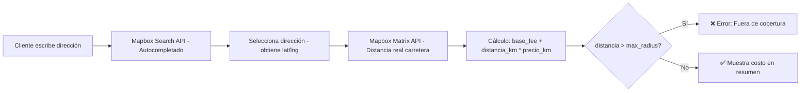

# 🚀 Plan: Domicilio Dinámico por Distancia (Mapbox)

## Resumen
Implementar cálculo dinámico del costo de domicilio basado en la distancia real por carretera entre el local y la dirección del cliente, usando **Mapbox Search API** (autocompletar) + **Mapbox Matrix API** (distancia ruta real).

## Arquitectura

## Archivos a Crear/Modificar

### 1. 🆕 Migración SQL: `supabase/migration_delivery_dynamic.sql`
- Agrega columnas a `settings`: `store_lat`, `store_lng`, `base_delivery_fee`, `price_per_km`, `max_delivery_radius_km`, `dynamic_delivery_enabled`
- Agrega columnas a `orders`: `delivery_lat`, `delivery_lng`, `delivery_distance_km`, `delivery_fee_calculated`

### 2. 🆕 Servicio: `src/services/mapboxService.js`
- `searchAddress(query)` → Mapbox Search Box API v2 (autocomplete con sesiones)
- `calculateDistance(storeLat, storeLng, destLat, destLng)` → Mapbox Matrix API
- `calculateDeliveryFee(distanceKm, baseFee, pricePerKm)` → cálculo puro

### 3. 🆕 Componente: `src/components/AddressAutocomplete.jsx`
- Input con dropdown de sugerencias de Mapbox
- Debounce de 300ms
- Captura lat/lng al seleccionar
- Dispara cálculo de distancia automáticamente

### 4. 🆕 CSS: `src/css/AddressAutocomplete.css`
- Estilos dark mode consistentes con el diseño existente

### 5. ✏️ Modificar: `src/data/dataSource.js`
- `normalizeSettings`: agregar campos nuevos de delivery dinámico
- `COLUMNAS_SETTINGS`: mapeo de claves para los campos nuevos
- `createOrder`: agregar metadatos de distancia/coordenadas

### 6. ✏️ Modificar: `src/components/CheckoutModal.jsx`
- Reemplazar input de dirección simple por `<AddressAutocomplete />`
- Estado para delivery fee dinámico, distancia, coords
- Calcular fee en tiempo real al seleccionar dirección
- Mostrar desglose: distancia + costo detallado
- Bloquear envío si fuera de cobertura

### 7. ✏️ Modificar: `src/App.jsx`
- Pasar delivery fee dinámico en `sendOrderToWhatsApp`
- Incluir metadatos de distancia en la orden

### 8. ✏️ Modificar: `src/utils/price.js`
- Adaptar `calculateOrderSummary` para aceptar fee dinámico vs fijo

### 9. ✏️ Modificar: `src/admin/pages/Configuracion.jsx`
- Sección nueva: "Domicilio Dinámico por Distancia"
- Campos: coordenadas del local, tarifa base, precio/km, radio máximo, toggle on/off

### 10. ✏️ Modificar: `.env`
- Agregar `VITE_MAPBOX_TOKEN`

## Reglas de Negocio
- `costo_domicilio = base_delivery_fee + (distance_km × price_per_km)`
- Si `distance_km > max_delivery_radius_km` → error "Fuera de cobertura"
- Si `dynamic_delivery_enabled = false` → usar tarifa fija actual (retrocompatible)
- El envío gratis (`freeDeliveryThreshold`) sigue aplicando sobre el fee calculado
